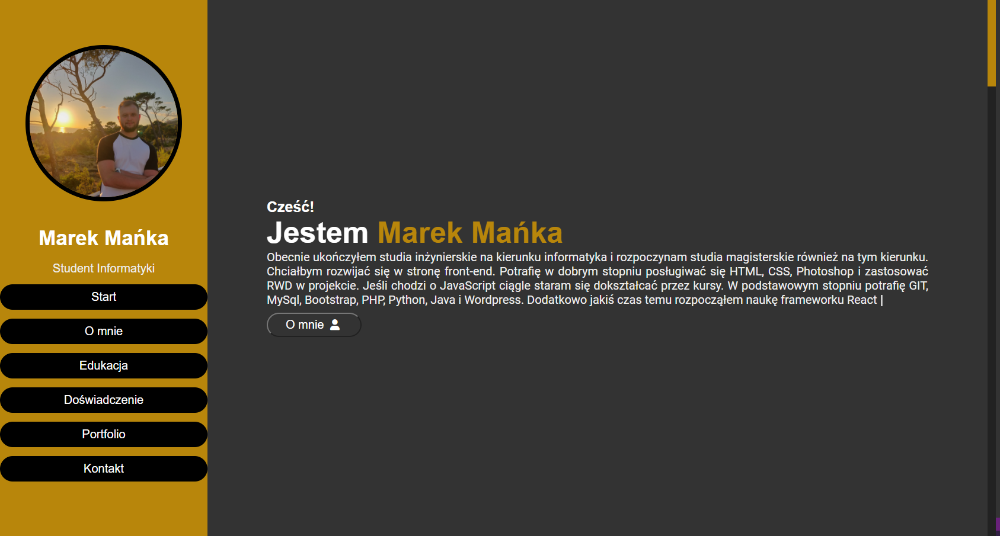

# :fire: PORTFOLIO :fire:

To visit page click https://manioo77.github.io/To-do-list-JavaScript/ or clone locally and follow instructions given below.

Website created to present my person. I described my education, experience and showed my projects.

## Screenshot of the working page

## Built With

This project was built using these technologies.

- JavaScript
- jQuery
- CSS3
- HTML5

## Getting Started

Clone down this repository. You will need node.js and git installed globally on your machine.

## :hammer: To run project

- Install local http server `npm install -g live-server` - [website](https://www.npmjs.com/package/live-server).

- Then run using `live-server`
